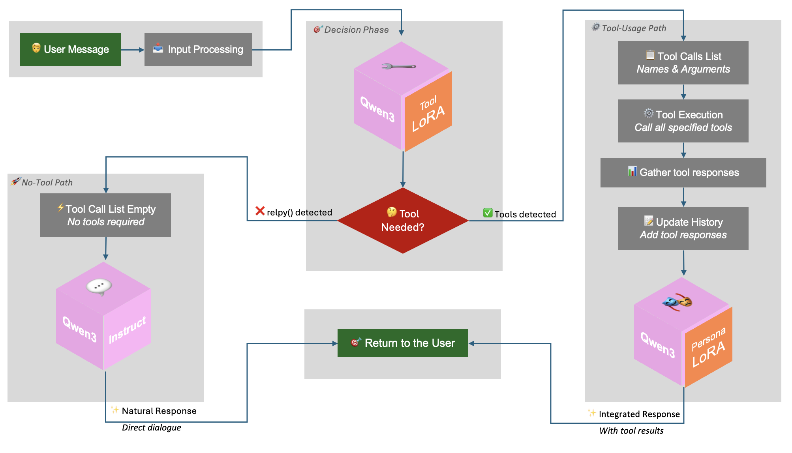

# Commonsense Persona-Grounded Dialogue Challenge 2025



Our approach leveraged Qwen3 as the base model due to its superior native tool-calling capabilities and well-defined interaction format. We decomposed the challenge into three specialized tasks—tool calling, direct dialogue, and dialogue with tool response integration—each handled by a dedicated Low-Rank Adaptation (LoRA) expert module, enabling efficient GPU utilization while maintaining high performance. The system was optimized using the Unsloth framework for accelerated training and inference, achieving response times of approximately 3 seconds while using less than 30GB of VRAM. To address the limited training data, we implemented a three-tier data augmentation strategy using GPT-o4-mini-high, expanding the dataset by nearly 300% through varying levels of linguistic and structural modifications while preserving core conversational patterns.

# Usage

## Install Dependencies

```bash
pip install -r requirements.txt
```

## Run Inference

### 1.7B Variant

```bash
python local_run_task1_test.py \
    --tool_lora_repo_id nuriyev/qwen3-1.7B-cpdc-tool-lora \
    --tool_lora_revision 851c417c1b76a3c30dd61e6a188bb49d9c7ee701 \
    --persona_lora_repo_id nuriyev/qwen3-1.7B-cpdc-persona-lora \
    --persona_lora_revision 5817c8459bdf84352989ca7232ebbeb59a86e6d2 \
    --base_model_repo_id unsloth/qwen3-1.7B \
    --base_model_revision 6262b50d6c1f8ee5e4ac750d710c33603bfc2a0c
```

### 14B Variant

```bash
python local_run_task1_test.py \
    --tool_lora_repo_id nuriyev/qwen3-14B-cpdc-tool-lora \
    --tool_lora_revision 490bb07891ce123b9e6d3fe90fced5bb6b6caf2f \
    --persona_lora_repo_id nuriyev/qwen3-14B-cpdc-persona-lora \
    --persona_lora_revision 89064cd1fa0695ef50125a45c268153c91dc3d4d \
    --base_model_repo_id unsloth/Qwen3-14B \
    --base_model_revision b8755c0b498d7b538068383748d6dc20397b4d1f
```

# References

- Public Leaderboard: https://www.aicrowd.com/challenges/commonsense-persona-grounded-dialogue-challenge-2025/leaderboards
- Winners Announcement: https://discourse.aicrowd.com/t/winners-call-for-paper/17412
- Technical report ([Wordplay website](https://wordplay-workshop.github.io/modern/#:~:text=Efficient%20Tool%2DCalling%20Multi%2DExpert%20NPC%20Agent%20for%20Commonsense%20Persona%2DGrounded%20Dialogue)): https://wordplay-workshop.github.io/pdfs/12.pdf
-  Technical report (Arxiv): https://arxiv.org/abs/2511.01720

